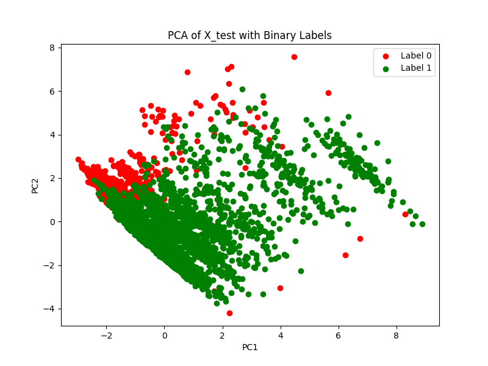
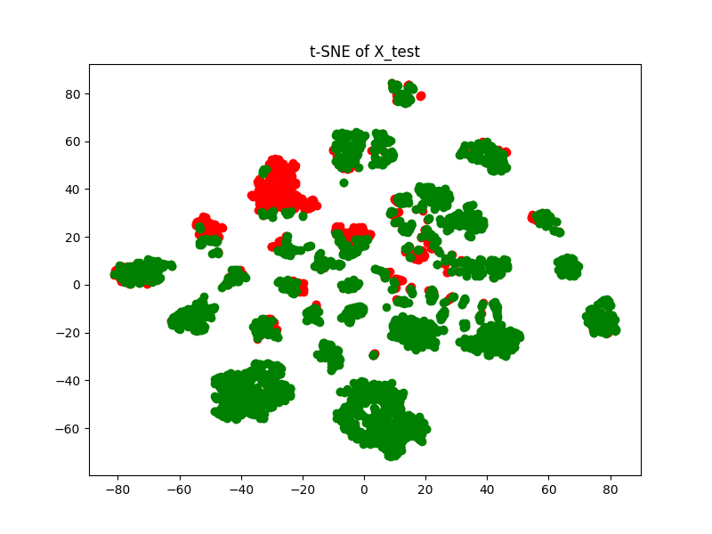

# ML Classifiers examined:
 - Support Vector Classifier ✅
 - One Class Support Vector Classifier 🚧
 - Isolation Forest 🚧
 - Logistic Regression ✅
### Support Vector Classifier:

Best parameters are selected based on hyperparameter tuning of the C and Gamma values. 
The best parameters are
***{'C': 63.0957344480193,
 'gamma': 0.001}*** with a score of 0.77 in the evaluation. The models are trained using a data consisting of 
about 200 dimensions. The final accuracy of the model on an unseen data is about 87%.

The following is the visualization of the data when applied PCA with a selection of 2 components,

Explored another visualization technique namely t-SNE also with a component selection of 2,

When observed on the logistic regression technique the classifier resulted in a test score of about 83%.
The plots also nearly resemble a similar pattern.